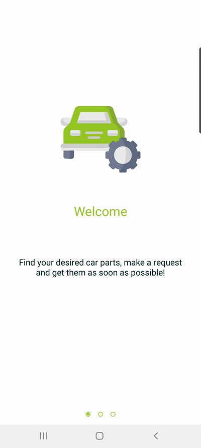
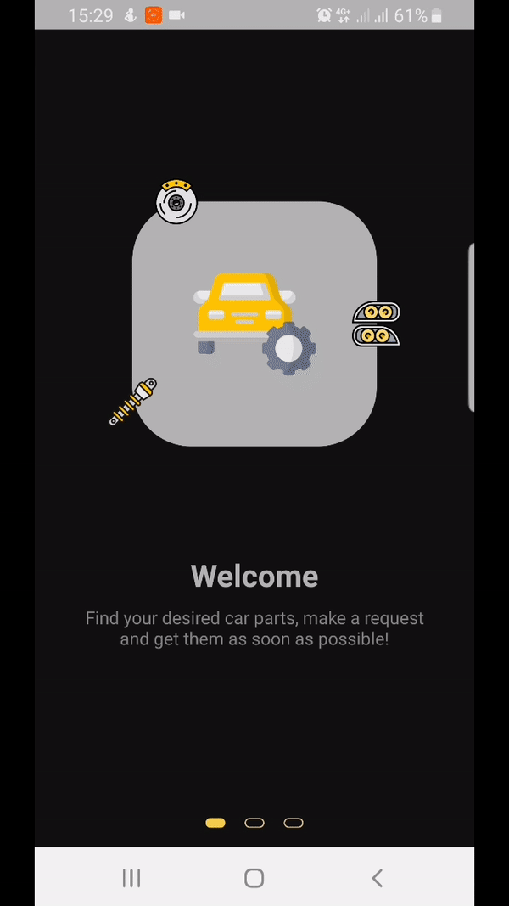

# OnBoarding using MotionLayout

This is a simple example, which demonstrates, how to use MotionLayout for building OnBoarding screen.

Two GIFs below shows cool animations in light and dark modes, respectively.

